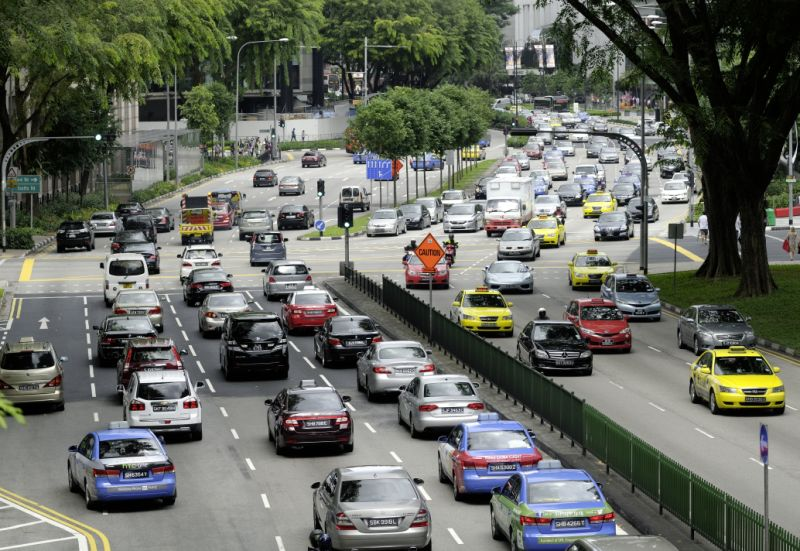
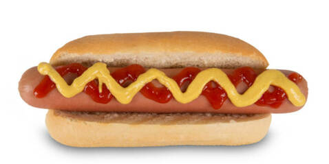
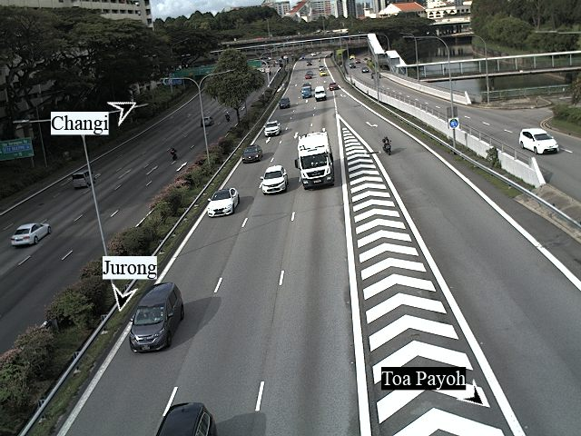
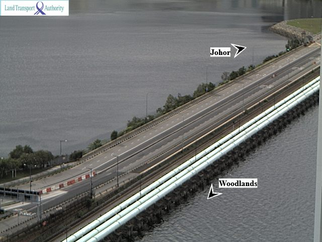

# IBM-Watson-Visual-Recognition
Detecting the presence of car on the road by training with images that consist of cars on the road. This will be done by creating custom classifier by IBM Watson.

#### Before we create our own custom classifier, we have to obtain an APIKEY and URL code from your IBM cloud account. 


1. Go to https://cloud.ibm.com/docs/visual-recognition/object-detection.html?programming_language=python
2. Go to the Visual Recognition page in the catalog.
3. Sign up for a free IBM Cloud account or log in.
4. Click Create.
5. Copy the credentials to authenticate to your service instance
6. On the Manage page, click Show Credentials.
7. Copy the API Key and URL values.


#### IBM has their own default classifier and food classifier. We start off by installing IBM watson package, importing the essential libraries and authenticating with API key

```python
pip install --upgrade "ibm-watson>=4.0.1"
```

```python
import json
from ibm_watson import VisualRecognitionV3
from ibm_cloud_sdk_core.authenticators import IAMAuthenticator
```

```python
authenticator = IAMAuthenticator({'API key'}) #replace {'API key'} with the API key copied earlier
visual_recognition = VisualRecognitionV3(
    version='2018-03-19',
    authenticator=authenticator
)

visual_recognition.set_service_url({'URL'}) #replace {'URL'} with the URL copied earlier

```
#### IBM default classifier is able to recognize a variety of object but lacks accuracy

Image used: 



```python

 #URL of your image
url = 'https://s.yimg.com/ny/api/res/1.2/lSzov3E5lk3Vcpx.s0WQvw--~A/YXBwaWQ9aGlnaGxhbmRlcjtzbT0xO3c9ODAw/http://media.zenfs.com/en/homerun/feed_manager_auto_publish_494/bcce30bc7401eef87973b59442e6fa51'

classes_result = visual_recognition.classify(url=url).get_result()
print(json.dumps(classes_result, indent=2))
```

Result:
```
{
  "images": [
    {
      "classifiers": [
        {
          "classifier_id": "default",
          "name": "default",
          "classes": [
            {
              "class": "divided highway",
              "score": 0.844,
              "type_hierarchy": "/road/divided highway"
            },
            {
              "class": "road",
              "score": 0.981
            },
            {
              "class": "carriageway",
              "score": 0.659,
              "type_hierarchy": "/road/carriageway"
            },
            {
              "class": "highway",
              "score": 0.523,
              "type_hierarchy": "/road/highway"
            },
            {
              "class": "arterial road",
              "score": 0.5,
              "type_hierarchy": "/road/arterial road"
            },
            {
              "class": "gray color",
              "score": 0.995
            }
          ]
        }
      ],
      "source_url": "https://s.yimg.com/ny/api/res/1.2/lSzov3E5lk3Vcpx.s0WQvw--~A/YXBwaWQ9aGlnaGxhbmRlcjtzbT0xO3c9ODAw/http://media.zenfs.com/en/homerun/feed_manager_auto_publish_494/bcce30bc7401eef87973b59442e6fa51",
      "resolved_url": "https://s.yimg.com/ny/api/res/1.2/lSzov3E5lk3Vcpx.s0WQvw--~A/YXBwaWQ9aGlnaGxhbmRlcjtzbT0xO3c9ODAw/http://media.zenfs.com/en/homerun/feed_manager_auto_publish_494/bcce30bc7401eef87973b59442e6fa51"
    }
  ],
  "images_processed": 1,
  "custom_classes": 0
}
```

#### IBM food classifier is able to recognize a variety of food with higher accuracy

Image used: 



```python
url = 'https://regmedia.co.uk/2017/07/07/hotdog.jpg?x=648&y=324&crop=1'
classifier_ids = ["food"]

classes_result = visual_recognition.classify(url=url, classifier_ids=classifier_ids).get_result()
print(json.dumps(classes_result, indent=2))
```

```
{
  "images": [
    {
      "classifiers": [
        {
          "classifier_id": "food",
          "name": "food",
          "classes": [
            {
              "class": "hotdog",
              "score": 0.722,
              "type_hierarchy": "/snack food/sandwich/hotdog"
            },
            {
              "class": "sandwich",
              "score": 0.722
            },
            {
              "class": "snack food",
              "score": 0.722
            },
            {
              "class": "frankfurter bun",
              "score": 0.526,
              "type_hierarchy": "/bread/bun/frankfurter bun"
            },
            {
              "class": "bun",
              "score": 0.526
            },
            {
              "class": "bread",
              "score": 0.526
            }
          ]
        }
      ],
      "source_url": "https://regmedia.co.uk/2017/07/07/hotdog.jpg?x=648&y=324&crop=1",
      "resolved_url": "https://regmedia.co.uk/2017/07/07/hotdog.jpg?x=648&y=324&crop=1"
    }
  ],
  "images_processed": 1,
  "custom_classes": 0
}
```

#### Creating a custom classifier to recognize the objects you want

```python
# cars.zip, empty_roads.zip and buildings.zip are zip files with photos to be used for training the classsifier
with open('./cars.zip', 'rb') as cars, open(
        './empty_roads.zip', 'rb') as empty_roads, open(
            './buildings.zip', 'rb') as buildings:
    model = visual_recognition.create_classifier(
        'Car',
        positive_examples={'cars': cars, 'empty_roads': empty_roads},
        negative_examples=buildings).get_result()
print(json.dumps(model, indent=2))
```
Result below. Notice the status now says "training". 
```
{
  "classifiers": [
    {
      "classifier_id": "Car_345188264",
      "name": "Car",
      "status": "training",
      "owner": "91187b85-5c16-4256-9fd8-968ccb873dea",
      "created": "2020-06-14T05:49:42.725Z",
      "updated": "2020-06-14T05:49:42.725Z",
      "classes": [
        {
          "class": "empty_roads"
        },
        {
          "class": "cars"
        }
      ],
      "core_ml_enabled": true
    },
```

#### Checking status of custom classifier and how many custom classifiers you have in your account.
```python
classifiers = visual_recognition.list_classifiers(verbose=True).get_result()
print(json.dumps(classifiers, indent=2))
```

Result below. Status is now "ready" and classifier is ready to be used.
```
{
  "classifiers": [
    {
      "classifier_id": "Car_345188264",
      "name": "Car",
      "status": "ready",
      "owner": "91187b85-5c16-4256-9fd8-968ccb873dea",
      "created": "2020-06-14T05:49:42.725Z",
      "updated": "2020-06-14T05:49:42.725Z",
      "classes": [
        {
          "class": "empty_roads"
        },
        {
          "class": "cars"
        }
      ],
      "core_ml_enabled": true
    }
```

#### Deleting custom classifier.

One free account from IBM cloud only allows at most 2 custom classifier. In order to create new custom classifier, you will have to delete one.

```python
visual_recognition.set_service_url('https://api.us-south.visual-recognition.watson.cloud.ibm.com/instances/91187b85-5c16-4256-9fd8-968ccb873dea')

visual_recognition.delete_classifier({'classifier_id'}) #replace {'classifier_id'} with the classifier ID you wish to delete.
```

#### Testing custom classifier.

Image used: 



```python

url = 'https://www.mytransport.sg/trafficsmart/images/6708_1410_20200614141206_a00fa5.jpg'
classifier_ids={'classifier_id'} #replace {'classifier_id'} with the classifier ID you created

classes_result = visual_recognition.classify(url=url, classifier_ids=classifier_ids, threshold=0.0).get_result()
print(json.dumps(classes_result, indent=2))

```

Result below. We can see there is a confidence score of 0.901 that there are cars on the road
```
{
  "images": [
    {
      "classifiers": [
        {
          "classifier_id": "Car_1729701386",
          "name": "Car",
          "classes": [
            {
              "class": "cars",
              "score": 0.901
            }
          ]
        }
      ],
      "source_url": "https://www.mytransport.sg/trafficsmart/images/6701_1649_20200616165102_488d5f.jpg",
      "resolved_url": "https://www.mytransport.sg/trafficsmart/images/6701_1649_20200616165102_488d5f.jpg"
    }
  ],
  "images_processed": 1,
  "custom_classes": 2
}
```

#### Testing custom classifier with an empty road

Image used: 



```python
url = 'https://www.mytransport.sg/trafficsmart/images/2701_1653_20200616165501_b752f7.jpg'
classifier_ids={'classifier_id'} #replace {'classifier_id'} with the classifier ID you created

classes_result = visual_recognition.classify(url=url, classifier_ids=classifier_ids, threshold=0.0).get_result()
print(json.dumps(classes_result, indent=2))
```

Result below. There is a confidene score of 0.903 that the road is empty.
```
{
  "images": [
    {
      "classifiers": [
        {
          "classifier_id": "Car_1729701386",
          "name": "Car",
          "classes": [
            {
              "class": "empty_roads",
              "score": 0.903
            }
          ]
        }
      ],
      "source_url": "https://www.mytransport.sg/trafficsmart/images/2701_1653_20200616165501_b752f7.jpg",
      "resolved_url": "https://www.mytransport.sg/trafficsmart/images/2701_1653_20200616165501_b752f7.jpg"
    }
  ],
  "images_processed": 1,
  "custom_classes": 2
}
```

## Future development of project:
The current project is able to detect the presence of cars on the road. It can be further improved to detect presence of car accidents. If there are any traffic accidents, the Emergency Response Team will be activated immediately. This can greatly reduce the manpower keeping an eye on the road.


